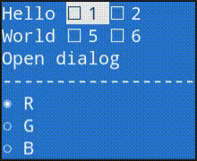

Modern C++ GUI library for small displays. Developed with microcontrollers in mind. Experimental phase.

* [Character based](https://en.wikipedia.org/wiki/Box-drawing_character), platform independent, [immediate mode](https://en.wikipedia.org/wiki/Immediate_mode_(computer_graphics)). Works as long as a character can be printed in x,y coordinates (for instance in [ncurses](https://tldp.org/HOWTO/NCURSES-Programming-HOWTO/index.html), [Zephyr RTOS cfb](https://docs.zephyrproject.org/latest/reference/display/index.html), etc).
* Cursor (x,y).
* Many screens at once. **????** **???????!!!!!!**
* Input handling hooks for easy integration.
* Minimal (no?) dependencies.
* No dynamic allocation

# Hooks
* print at cursor's possition with clipping (clips to the viewport area even if passed coordinates are **negative**).
* switch color (2 colors)
* move cursor

# FAQ
* How to add a margin? No automatic margins, just add a space.

# Tutorial
aaa

# TODO
* [ ] vbox (hbox, hbox) works OK, but hbox (vbox, vbox) does not (at least not when the nesting structure is complicated).
* [x] screen wide/tall
* [x] current focus
* [ ] text wrapping widget (without scrolling up - only for showinng bigger chunkgs of text, like logs)
* [ ] scrolling container - as the above, but has a buffer (license, help message).
* [x] checkboxes
* [x] radiobutons (no state)
* [x] radiobutton group (still no state, but somehow manages the radios. Maybe integer?)
* [ ] menu / list (possibly implemented using vbox and radio-s without radio icon (as an option))
  * [ ] Demo - menu 
  * [ ] Navigation between screens - research how to do it the best from the API perspective.
* [x] combo - "action" key changes the value (works for numbers as well)
  * [ ] icon aka indicator aka animation (icon with states) - this can be implemented using the combo (with an option).
* [x] Button (with callback).
* [ ] std::string - like strings??? naah...
* [ ] callbacks and / or references - for all widgets that has input. 
* [x] bug: empty line after nested container 
* [x] A window. Like ncurses window (i.e. area). It has to have its own coordinate system and focusCounter. It should overlay what was previously displayed (easy and concise)
  * [x] Dialog
* [ ] Prepare for compile time optimization
  * [ ] Cmake target which tests the size with a tool. Like size or bloaty. Saves a list with statistics + commit hash. Maybe a commit hook?
* [ ] Console backend (with or even without input)
  * [ ] Styling (external tempolate class impacting various aspects of the output)
  * [ ] AND / OR Widget parameters dictating the looks.